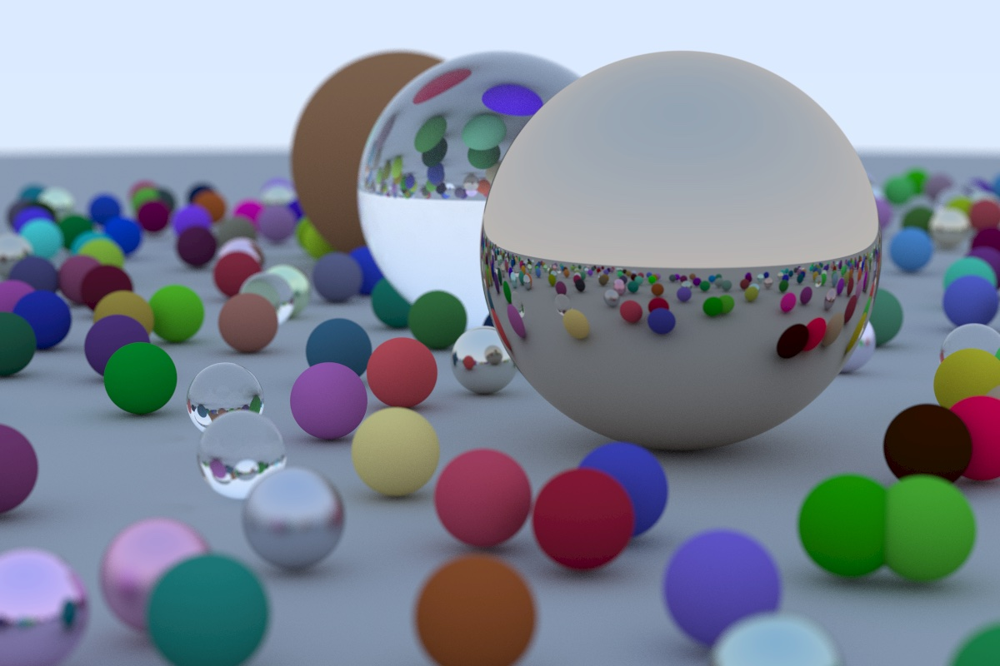

# ray-tracing-1
Rust implementation of Peter Shirley's *Ray Tracing in One Weekend*. Book can be
found [here](https://raytracing.github.io/books/RayTracingInOneWeekend.html).

## Final result
The final result consists of a collection of small spheres with random locations and 3 larger center spheres. The spheres are programmed with dielectric (glass), metal and Lambertian (matte/diffuse) materials to determine how rays reflect, refract and scatter, simulating the physics of real light rays. Depth of field is visible in the final image, simulating camera focus.

